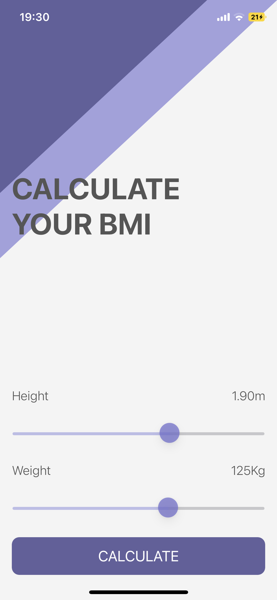
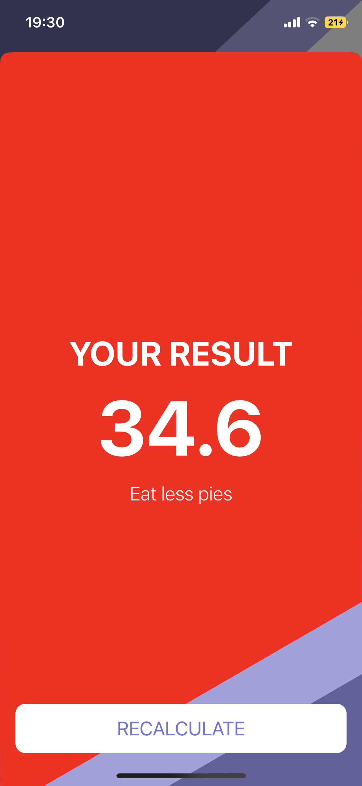

#  BMI Calculator
An app designed to calculate a persons BMI(Body Mass Index), by using the users weight and height. Once the calculate button is tapped, it then calculates the BMI based on the following forumla.

bmi = weight / (height * height)

*The reason we height * height is to get the squared root of height.

### What was learnt
- MVC Design Pattern
- StoryBoards
- UIKit
- Creating and linking multiple View Controllers
- Creating and linking IBOutlets and IBActions
- Creating and mutating structs
- Creating functions
- Optional Values
- If statements

## Portrait

## Landscape

## Our Goal

The goal of this tutorial is to learn more about Optionals, solidify your understanding of the MVC design pattern and to introduce the concept of Classes. We’ll compare objects created from classes with instances of Structs that we learnt about earlier. 

## What you will create

By the end of the module, you will have made a Body Mass Index calculator. Based on the user’s weight and height it will calculate their body mass and give a piece of health advice depending on whether if they have eaten too many pies or if they need to eat more pies. 

## What you will learn

* How to create multi-screen apps with animated navigation.
* Optional binding, optional chaining and the nil coalescing operator.
* How to create classes and difference between classes and structs. 
* Pass by value vs. pass by reference. 
* Formatting Strings. 
* Color literals.

## COPYRIGHT
MIT License

Copyright (c) [2021] [Stewart James Clay]

Permission is hereby granted, free of charge, to any person obtaining a copy
of this software and associated documentation files (the "Software"), to deal
in the Software without restriction, including without limitation the rights
to use, copy, modify, merge, publish, distribute, sublicense, and/or sell
copies of the Software, and to permit persons to whom the Software is
furnished to do so, subject to the following conditions:

The above copyright notice and this permission notice shall be included in all
copies or substantial portions of the Software.

THE SOFTWARE IS PROVIDED "AS IS", WITHOUT WARRANTY OF ANY KIND, EXPRESS OR
IMPLIED, INCLUDING BUT NOT LIMITED TO THE WARRANTIES OF MERCHANTABILITY,
FITNESS FOR A PARTICULAR PURPOSE AND NONINFRINGEMENT. IN NO EVENT SHALL THE
AUTHORS OR COPYRIGHT HOLDERS BE LIABLE FOR ANY CLAIM, DAMAGES OR OTHER
LIABILITY, WHETHER IN AN ACTION OF CONTRACT, TORT OR OTHERWISE, ARISING FROM,
OUT OF OR IN CONNECTION WITH THE SOFTWARE OR THE USE OR OTHER DEALINGS IN THE
SOFTWARE.
